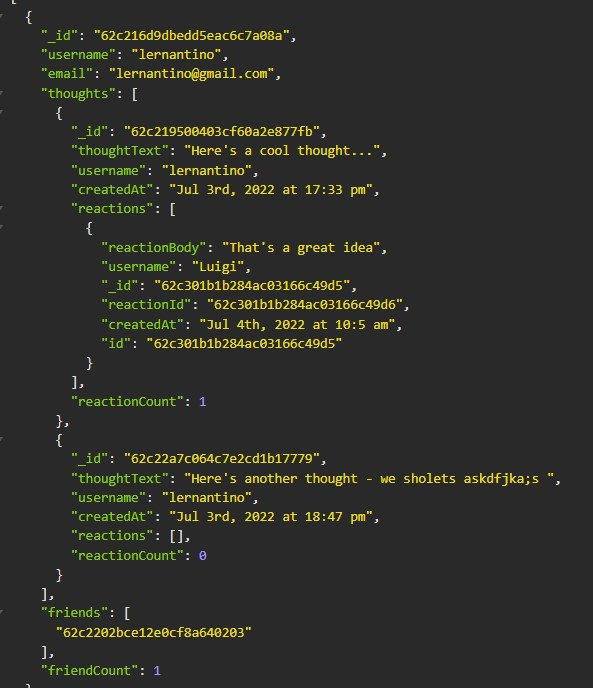

# NoSQL Social Network

## Description
This is the backend work for a social network web application.

## Database
This database is created using NoSQL and allows users to create user profiles, have friends, create thoughts and respond to other thoughts.

AS A social media startup
I WANT an API for my social network that uses a NoSQL database
SO THAT my website can handle large amounts of unstructured data

Here is an example where you can see a user with a thought, a reaction to that thought, and a friend:

## Example of Use
 [Here](https://drive.google.com/file/d/1q2dKQr0ObFcLTBWuYIEd74XoirJWCBHn/view) is a video showing the functions of the site working in Insomnia.

## Built With
This program the following:
* Javascript (express, MongoDB, mongoose)
* Testing in Insomnia